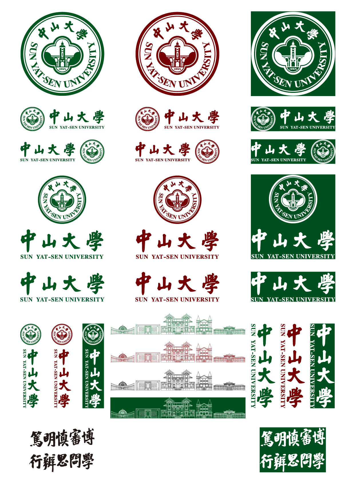

# sysu-logo
中山大学校徽矢量图

## 版权声明
- **校徽版权归[中山大学](https://www.sysu.edu.cn/)所有，本仓库仅用于教育与学习目的。**
- 官方源文件下载：
  - 校徽相关文件（`.ai` 格式）：[中山大学视觉形象识别系统手册](https://home3.sysu.edu.cn/sysuvi/)；
  - 三校区五校园线稿相关文件（`.pptx` 格式）：[校庆主题PPT下载](https://sysu100.sysu.edu.cn/info/1301/8571.htm)和[中大校庆ppt模板_红色主题.pptx](https://sysu100.sysu.edu.cn/system/_content/download.jsp?urltype=news.DownloadAttachUrl&owner=1996655435&wbfileid=13260396)。

## 使用说明
- 矢量图说明：矢量图是由数学公式描述的图像，放大或缩小时不会失真。
- 本仓库主要提供校徽的矢量格式文件，便于在不同场景中使用：
  - `.svg` 文件：适用于 Word、PPT 等办公软件；
  - `.pdf` 文件：适用于 LaTeX 等排版软件；
  - `.png` 文件（非矢量格式；150 dpi）：属于位图格式，存在缩放失真问题，建议优先使用矢量文件。
- 提供三种配色版本：
  - 绿色（`[C,M,Y,K]=[100,00,100,60]`）；
  - 红色（`[C,M,Y,K]=[30,100,100,50]`）；
  - 反白（适用于深色背景，`[C,M,Y,K]=[00,00,00,00]`）。

## 效果展示
